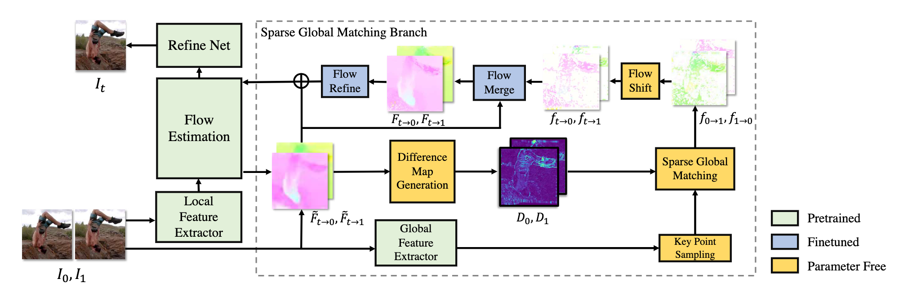
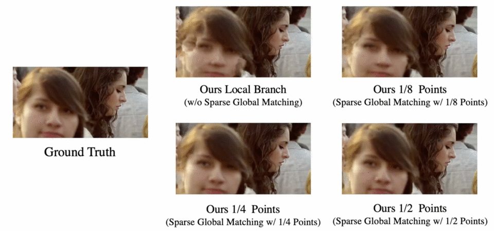
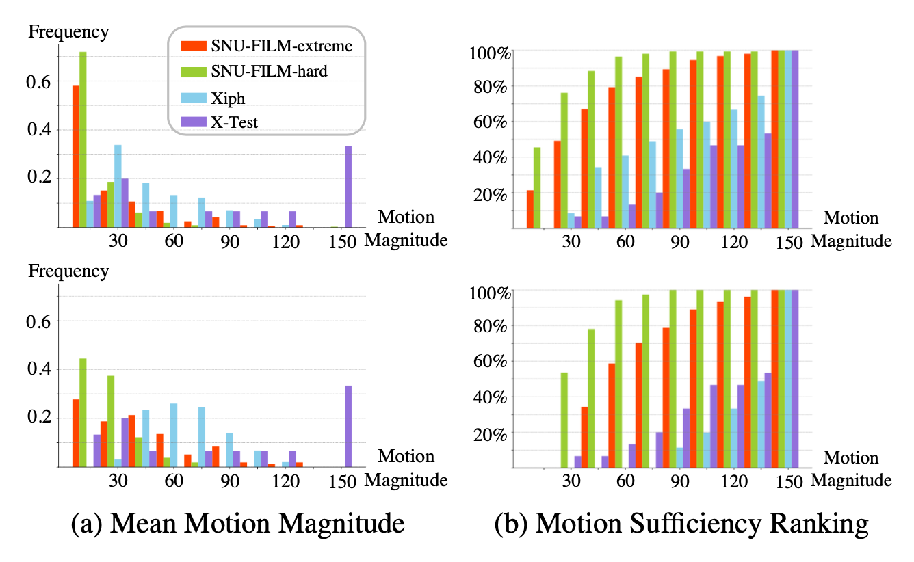

# Sparse Global Matching for Video Frame Interpolation with Large Motion

<p align="center">
      <a href="https://scholar.google.com.hk/citations?hl=zh-CN&view_op=list_works&gmla=AKKJWFe0ZBvfA_4yxMRe8BW79xNafjCwXtxN10finOaqV1EREnZGxSX6DbpZelBUJD0GZmp5S7unCf76xrgOfnS6SVA&user=dvUKnKEAAAAJ" target='_blank'>Chunxu Liu*</a>,&nbsp;
      <a href="https://scholar.google.com.hk/citations?user=48vfuRAAAAAJ&hl=en" target='_blank'>Guozhen Zhang*</a>,&nbsp;
      <a href="https://scholar.google.com/citations?user=1c9oQNMAAAAJ&hl=en" target='_blank'>Rui Zhao</a>,&nbsp;
      <a href="https://scholar.google.com.hk/citations?user=HEuN8PcAAAAJ&hl=en" target='_blank'>Limin Wang</a>,&nbsp;
    <br>
  Nanjing University, &nbsp; SenseTime Research
  </p>

<p align="center">
  <a href="http://arxiv.org/abs/2404.06913" target='_blank'>
    
  </a> 
  <a href="https://sgm-vfi.github.io/" target='_blank'>
    
  </a>
</p>

<p style="font-size:30px;">
        <b>TL;DR: </b>We introduce <b>Sparse Global Matching Pipeline</b> for Video Frame Interpolation task: 
      </p>
      <p style="font-size:25px;">
        0. Estimate intermediate initial flows with local information. <br>
        1. Identify flaws in the initial flows.<br>
        2. Estimate flow compensation by <b>Sparese Global Matching</b>. <br>
        3. Merge the flow compensation with the initial flows. <br>
        4. Compute the intermediate frame using the flows from 3. and keep refining. 
      </p>

<div align="center">
  
</div>

To evaluate the effectiveness of our method in handling large motion, we carefully curate a more challenging subset from commonly used benchmarks.
Experiments shows that our work can bring improvements when 
dealing with challenging large motion benchmarks.
<div align="center">
  
</div>

## Training Dataset Preparation
We need [X4K1000FPS](https://github.com/JihyongOh/XVFI/tree/main) for our sparse global matching branch fine-tuning, 
and [Vimeo90K](http://toflow.csail.mit.edu/) for our local branch training. After downloading and processing the datasets,
you can place them in the following folder structure:
```commandline
.
├── ...
└── datasets
    ├── X4K1000FPS
    │   ├── train
    │   ├── val
    │   └── test
    └── vimeo_triplet (needed if train local branch)
        ├── ...
        ├── tri_trainlist.txt
        └── sequences
```


## Environment Setup
```commandline
conda create -n sgm-vfi python=3.8 
pip install torch==1.13.1+cu117 torchvision==0.14.1+cu117 --extra-index-url https://download.pytorch.org/whl/cu117
pip install -r requirements.txt
```

## Sparse Global Matching Fine-tuning
### Pretrained File Preparation
We provide the pretrained local branch model for a quicker
launch of sparse global matching. You can download the
pretrained model [here](https://drive.google.com/drive/folders/1S5O6W0a7XQDHgBtP9HnmoxYEzWBIzSJq) and place it in
`[project_folder]/log/ours-local/ckpt/ours-local.pth`. 

Furthermore, for the global feature extractor [GMFlow](https://github.com/haofeixu/gmflow),
you can download the pretrained model in [here](https://drive.google.com/file/d/1d5C5cgHIxWGsFR1vYs5XrQbbUiZl9TX2/view?usp=sharing),
then unzip it and place `gmflow_sintel-0c07dcb3.pth` in `[project_folder]/pretrained/gmflow_sintel-0c07dcb3.pth`.

**Finally, for fine-tuning sparse global matching branch, 
the file folder should look like [this](#jump).**

### Finetuning
After the preparation, you can modify and check the settings in `config.py`,
the default setting is for `ours-small-1/2` fine-tuning. 

Finally, you can start the fine-tuning with the following command:
```commandline
torchrun --nproc_per_node=4 train_x4k.py --batch_size 8 --need_patch --train_data_path path/to/X4K/train --val_data_path path/to/X4K/val
```

### <span id="jump"> Top Related Files </span>
```commandline
.
├── train_x4k.py
├── Trainer_x4k.py
├── dataset_x4k.py
├── config.py
├── pretrained
│   └── gmflow_sintel-0c07dcb3.pth
├── log
│   └── ours-local
│       └── ckpt
│           └── ours-local.pth
└── model
    ├── __init__.py
    ├── flow_estimation_global.py
    ├── matching.py
    ├── gmflow.py
    └── ...
```


## Local Branch Training
We also provide scripts for training the local branch.
After preparing the [Vimeo90K](http://toflow.csail.mit.edu/)
dataset, and check the settings in `config_base.py` 
(default setting is for `ours-local-branch` model training),
you can start the training process by the following command:
```commandline
torchrun --nproc_per_node=4 train_base.py --batch_size 8 --data_path ./vimeo_triplet 
```

### Top Related Files:
```commandline
.
├── train_base.py
├── Trainer_base.py
├── dataset.py
├── config_base.py
└── model
    ├── __init__.py
    ├── flow_estimation_local.py
    └── ...
```

## Evaluation
In our paper, we analyzed the mean motion magnitude and motion 
sufficiency (the minimum of the top 5% of each pixel’s flow magnitude) 
in the most frequently used large motion benchmarks.
<div align="center">
  
</div>

### Evaluation Datasets Preparation
As a result, we curated the most challenging half from Xiph and SNU-FILM hard and extreme with the 
help of `raft-sintel.pth` [checkpoint](https://drive.google.com/drive/folders/1sWDsfuZ3Up38EUQt7-JDTT1HcGHuJgvT) provided in [RAFT](https://github.com/princeton-vl/RAFT).

The resulting benchmark is available [here](https://drive.google.com/drive/folders/1M6dzVNMuVJsA8XXt8mN0shS9Ig3vyKvy).
You can put `top-half-motion-sufficiency_test-hard.txt`, `top-half-motion-sufficiency_test-extreme.txt` in SNU-FILM dataset folder and `top-half-motion-sufficiency-gap2.txt` in Xiph dataset folder.

### Model Checkpoint Preparation
We provide the checkpoints [here](https://drive.google.com/drive/folders/1S5O6W0a7XQDHgBtP9HnmoxYEzWBIzSJq) for evaluation.
Please download and place them in the following folder structure:
```commandline
.
├── ...
└── log
    └── ours-1-2-points
        └── ckpt
            └── ours-1-2-points.pth
```

We provide the evaluation script of `ours-1-2-points` as follows:
#### XTest-L
```commandline
python benchmark/XTest_interval.py --path path/to/XTest/test --exp_name ours-1-2-points --num_key_points 0.5
```
#### SNU-FILM-hard/extreme-L
```commandline
python benchmark/SNU_FILM.py --path ./data/SNU-FILM --exp_name ours-1-2-points --num_key_points 0.5
```
(Suggestion: You can use `ln -s path/to/SNUFILM (project folder)/data/SNU-FILM` to avoid extra processing on the input path name)
#### Xiph-L
```commandline
python benchmark/Xiph.py --path ./xiph --exp_name ours-1-2-points --num_key_points 0.5
```
(Suggestion: You can use `ln -s path/to/Xiph (project folder)/xiph` to avoid extra processing on the input path name)


[//]: # (## Citation)

[//]: # ()
[//]: # (```commandline)

[//]: # ()
[//]: # (@inproceedings{liu2024sparse,)

[//]: # ()
[//]: # (  title={Sparse Global Matching for Video Frame Interpolation with Large Motion},)

[//]: # ()
[//]: # (  author={Liu, Chunxu and Zhang, Guozhen and Zhao, Rui and Wang, Limin},)

[//]: # ()
[//]: # (  booktitle={Proceedings of the IEEE/CVF Conference on Computer Vision and Pattern Recognition},)

[//]: # ()
[//]: # (  pages={xxxx-xxxx},)

[//]: # ()
[//]: # (  year={2024})

[//]: # ()
[//]: # (})

[//]: # ()
[//]: # (```)

## License and Acknowledgement
This project is released under the Apache 2.0 license. 
The codes are based on GMFlow, RAFT, EMA-VFI, RIFE, IFRNet. 
Please also follow their licenses. Thanks for their awesome works.
